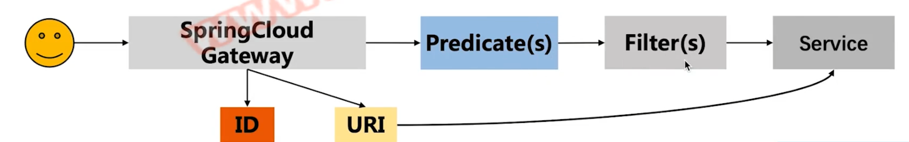

## 分布式解决方案
# skill
## 1：skill-common 先创建common ，包含通用返回类型，code data msg
## 2：skill-mvc-config 包含 统一全局异常处理等
## 3:skill-nacos-client
## 5:skill-admin服务应用监控
## 6：skill-authority-center 鉴权授权中心
jwt 组成的三个部分 header payload signature 且用圆点连接xxx.yyyy.zzzz

header :由两部分(Token 类型，加密算法名称) 组成，并使用Base64编码

payload kv 形式的数据，即你想传递的数据(授权的话就是token信息)

signature ：为了得到签名部分，你必须有编码过的header，编码过的payload，一个密钥，签名算法是header中指定的那个，然后对他们签名即可

screw 生成数据库文档
## 7：gateway 网关
网关是微服务工程架构下的唯一入口(客户端) ，GateWay提供了统一的路由方式，基于Filter 链的方式提供了网关的基本功能
Route(路由):是构建网关的基本模块，有id,uri,一系列的断言和过滤器组成
Predicate(断言):可以匹配Http请求中所有的内容(请求头，参数等等)，请求与断言相匹配则通过当前断言 
Filter(过滤器):包括全局和局部过滤器，可以在请求被路由前后对请求进行更改。

全局过滤器和局部过滤器
全局过滤器作用于所有的路由，不需要单独配置，通常用来实现统一化处理的业务需求
局部过滤器实现并生效的三个步骤
1：需要实现GateFilter,Ordered ,实现相关的方法
2：加入到过滤器工厂，并且将工厂注册到Spring容器中
3：在配置文件中进行配置，如果不配置则不启用此过滤器的规则(路由规则)
spring cloud gateway 路由常用的三种配置方式
1：在代码中注入RouterLocatorBean 并手工编写配置路由定义
2：在application.yml bootstrap.yml 等配置文件中配置spring.cloud.gateway
3：通过配置中心 (nacos) 实现动态的路由配置
## 7：sleuth+zipkin 分布式日志链路追踪
为了实现请求追踪，当请求发送到分布式系统的入口端点时，只需要服务跟踪框架为该请求创建一个唯一的跟踪请求，trace ID
为了统计各处理单元的时间延迟，当请求到达各个服务组件时，或是处理逻辑到达某个状态时，也通过一个唯一标识来标记他的开始，具体过程以及结束，Span ID
zipkin 解决微服务架构中延迟问题，包括数据的收集，存储，查找和展现
1：collector：收集器组件
2：Storage ：存储组件
3：API ：RESTFUL API 提供外部访问接口
4 UI：WebUi 提供可视化查询页面
## 8 SpringCloudSleuth+Zipkin+kafka 分布式日志收集
## 9 账户微服务

